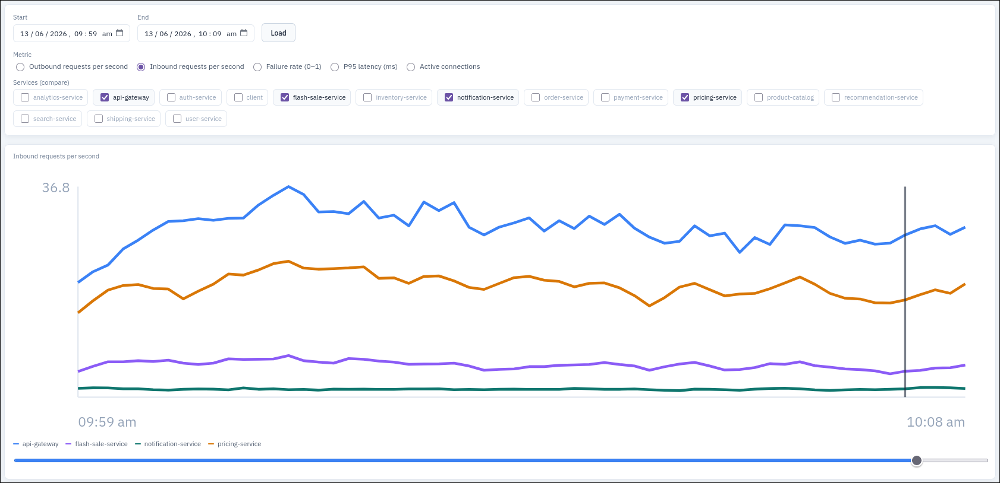

# Dhrishti

*A runtime observability engine for dynamically reconstructing distributed system architecture using eBPF.*




---

## TL;DR

**What it is:** Dhrishti watches live TCP traffic in the Linux kernel and rebuilds a real-time dependency graph of your microservices — no app instrumentation required.

**Stack:** eBPF (C) → Go engine → WebSocket/HTTP API → React + Cytoscape.js. Historical metrics go to **local Redis** (TimeSeries) and are served by a **FastAPI** history API.

**Daily workflow (after first-time setup):**

```bash
# 1. Mock microservices
cd mock_services && docker compose up --build

# 2. Dhrishti (Go engine + History API + frontend)
make dhrishti

# 3. Simulate traffic (tunable)
make run-simulation DURATION=15m VIRTUAL_USERS=200 CONNECTING_IPS=10
```

Open **http://localhost:5173** — **Live graph** for real-time topology, **Timeline** for metric charts, **Replay** to step through historical graph snapshots.

| Service | URL |
|---------|-----|
| Frontend | http://localhost:5173 |
| Go engine API | http://localhost:8090 |
| History API | http://localhost:8000 |
| Mock api-gateway | http://localhost:8080 |

---

## First-time setup

Run these once on a fresh clone (Linux only — eBPF requires it):

### 1. System dependencies

| Tool | Version | Notes |
|------|---------|-------|
| **Linux** | kernel 5.8+ | eBPF probes attach here |
| **Go** | 1.21+ | Engine |
| **Python 3** | 3.10+ | History API (venv created automatically) |
| **Node.js + npm** | 18+ | Frontend (`npm install` runs automatically) |
| **Docker + Compose** | current | Mock microservices |
| **Redis Stack** | local | `redis-cli ping` → `PONG`; must support TimeSeries (`TS.ADD`) |
| **k6** | current | Load tests — [install guide](https://grafana.com/docs/k6/latest/set-up/install-k6/) |
| **clang/llvm, libbpf** | — | eBPF probe build (`make ebpf`) |
| **sudo** | — | Required for eBPF and multi-IP benchmark client fleet |

### 2. Clone and configure

```bash
git clone <repo-url>
cd dhrishti

cp .env.example .env    # edit Redis URL / history settings if needed
make ebpf               # build eBPF probes (first time, or after probe changes)
```

`.env` is gitignored. `make dhrishti` loads it automatically.

`go.mod` / `go.sum` are committed — do **not** delete them. They pin Go dependencies. The compiled `main` binary and `frontend/node_modules/` are **not** in the repo; they are built locally.

### 3. Start Redis Stack (required for Timeline)

The Timeline tab needs **Redis with the TimeSeries module** (`TS.ADD`, `TS.RANGE`). Plain Redis or Valkey without TimeSeries is not enough — the metric chart and timeline load will fail with `unknown command 'TS.RANGE'`.

**Option A — Docker (recommended)**

Stop any existing Redis on port 6379 first, then:

```bash
docker run -d --name redis-stack \
  -p 6379:6379 \
  redis/redis-stack-server:latest
```

**Option B — Arch Linux (AUR)**

```bash
yay -S redis-stack-server
sudo systemctl enable --now redis-stack
```

**Option C — Other distros**

Install [Redis Stack](https://redis.io/docs/latest/operate/oss_and_stack/install/install-stack/) (not plain `redis-server`).

**Verify TimeSeries is active**

```bash
redis-cli ping
# PONG

redis-cli TS.INFO __probe__
# Should NOT say "unknown command". A "key does not exist" error is fine.
```

**Connect Dhrishti to Redis**

In `.env` (copy from `.env.example` if needed):

```bash
DHRISHTI_REDIS_URL=redis://localhost:6379
```

Both the Go engine (writes metrics + graph snapshots) and the FastAPI History API (reads them) use this URL. Restart `make dhrishti` after switching Redis.

**What each Redis feature powers**

| Feature | Redis commands | Used by |
|---------|----------------|---------|
| Metric charts (Timeline) | `TS.ADD`, `TS.RANGE` | Go writer + History API |
| Graph replay snapshots | `SET`, `ZADD` | Go writer + History API |
| Service list | `SADD`, `SMEMBERS` | Go writer + History API |

### 4. Verify

```bash
cd mock_services && docker compose up --build    # terminal 1
make dhrishti                                     # terminal 2 (Ctrl+C to stop)
make run-simulation DURATION=4m VIRTUAL_USERS=150 # terminal 3
```

`make dhrishti` automatically:

- builds eBPF probes if missing (`make ebpf`)
- creates `history-api/.venv` and installs Python deps
- runs `npm install` in `frontend/` if `node_modules/` is missing
- starts the Go engine (sudo), History API, and Vite dev server

Logs: `.dhrishti/logs/` (gitignored).

---

## Makefile commands

```bash
make help              # list all targets
make ebpf              # build eBPF probes only
make dhrishti          # start engine + history API + frontend
make stop-dhrishti     # kill background Dhrishti processes
make run-simulation    # k6 load against mock stack (Dhrishti must be running)
```

Simulation tunables:

```bash
make run-simulation DURATION=15m VIRTUAL_USERS=200 CONNECTING_IPS=10
```

---

## Documentation

| Doc | Contents |
|-----|----------|
| [docs/MOCK_SERVICES.md](./docs/MOCK_SERVICES.md) | 15-service stack architecture, API routes, Docker usage |
| [docs/BENCHMARK.md](./docs/BENCHMARK.md) | k6 load tests, A/B benchmark workflow, metric comparison |

---

## Overview

Dhrishti is a Linux-based observability system that infers service dependencies by tracing live TCP activity directly from the kernel using eBPF.

Instead of relying on manually maintained architecture diagrams, application-level tracing instrumentation, or predefined service topology, Dhrishti observes actual runtime behavior and reconstructs communication relationships dynamically.

The system captures kernel-level TCP lifecycle events, correlates them into runtime flows, enriches them with container metadata, and exposes a live dependency graph of the running system.

---

## Architecture

```text
Docker Workloads
        ↓
eBPF Kernel Probes
        ↓
Ring Buffer Telemetry
        ↓
Go Runtime Collector
        ↓
Flow Correlation Engine
        ↓
Runtime Graph State
        ↓
WebSocket Streaming + Redis History
        ↓
React / Cytoscape.js Visualization
```

---

## Runtime model

The Linux kernel only exposes low-level primitives such as processes, sockets, IP addresses, ports, and TCP state.

Dhrishti converts these into architectural relationships:

```text
api-gateway → auth-service
api-gateway → flash-sale-service → inventory-service
order-service → payment-service
```

---

## eBPF probes

| Probe | Purpose |
|-------|---------|
| `tcp_connect` | Outbound connection attempts — foundation of dependency inference |
| `inet_csk_accept` | Server-side accept — client/server correlation |
| `tcp_close` | Connection teardown — duration, churn, short-lived flows |
| `tcp_state` | State transitions (ESTABLISHED, FIN_WAIT, TIME_WAIT) |

---

## Current features

* Live TCP dependency inference
* Docker-aware service resolution
* Runtime flow tracking and rolling latency (P95)
* WebSocket-based graph streaming
* Live Cytoscape visualization with timeline replay
* Redis TimeSeries history (metrics + graph snapshots every ~10s)

---

## Example test architecture

Dhrishti is tested against a **flash-sale e-commerce** mock stack with **15 microservices**:

```text
k6 (host) → api-gateway
                ├→ auth-service, user-service, analytics-service
                ├→ product-catalog ← search-service, recommendation-service
                ├→ flash-sale-service → inventory-service, pricing-service
                ├→ cart-service → inventory-service
                └→ order-service → payment, shipping, notification
```

Entry service config (`dhrishti.json`):

```json
{ "entry_services": ["api-gateway"] }
```

---

## Tech stack

| Layer | Technology |
|-------|------------|
| Kernel instrumentation | eBPF (C) |
| Telemetry engine | Go |
| Runtime metadata | Docker Engine API |
| History store | Redis TimeSeries |
| History API | FastAPI |
| Frontend | React + Cytoscape.js |
| Streaming | WebSockets |

---

## Full A/B benchmark

For a formal baseline vs Dhrishti-ON comparison (not the quick simulation):

```bash
cd benchmark && ./baseline.sh              # Dhrishti OFF
make dhrishti                               # other terminal
cd benchmark && sudo ./benchmark.sh        # Dhrishti ON + report
```

See [docs/BENCHMARK.md](./docs/BENCHMARK.md) for methodology.

---

## Troubleshooting

| Symptom | Fix |
|---------|-----|
| `Redis not reachable` | Start Redis Stack on `:6379` (see section 3 above) |
| Timeline "Failed to load timeline data" | Redis missing TimeSeries — run `redis-cli TS.INFO __probe__`; if `unknown command`, switch to Redis Stack |
| `[history] TS.CREATE ... unknown command` in engine log | Same as above — replace plain Redis/Valkey with Redis Stack |
| `eBPF probes not built` | `make ebpf` |
| Frontend blank / module errors | `cd frontend && npm install` |
| History API 404 on timeline | Restart `make dhrishti` after pulling changes |
| Simulation timeouts | Lower `VIRTUAL_USERS` (try 150–200) |
| No timeline data | Dhrishti must run during the simulated window; snapshots every ~10s |
