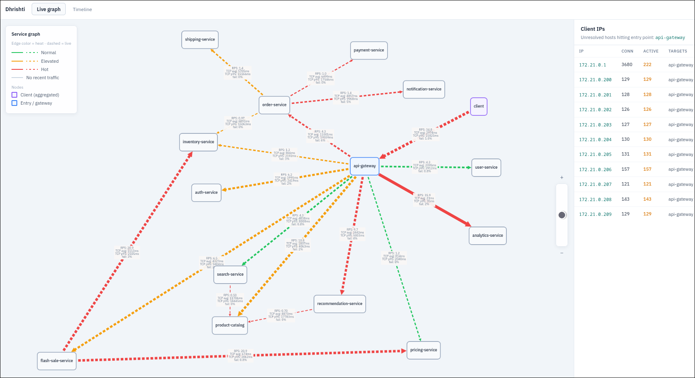

# Dhrishti

*A runtime observability engine for dynamically reconstructing distributed system architecture using eBPF.*

---

# Overview

Dhrishti is a Linux-based observability system that infers service dependencies by tracing live TCP activity directly from the kernel using eBPF.

Instead of relying on:

* manually maintained architecture diagrams,
* application-level tracing instrumentation,
* or predefined service topology,

Dhrishti observes actual runtime behavior and reconstructs communication relationships dynamically.

The system captures kernel-level TCP lifecycle events, correlates them into runtime flows, enriches them with container metadata, and exposes a live dependency graph of the running system.

---

# Architecture

```text
Docker Workloads
        ↓
eBPF Kernel Probes
        ↓
Ring Buffer Telemetry
        ↓
Go Runtime Collector
        ↓
Flow Correlation Engine
        ↓
Runtime Graph State
        ↓
WebSocket Streaming
        ↓
Cytoscape.js Visualization
```

---

# Runtime Model

The Linux kernel only exposes low-level primitives such as:

```text
processes
sockets
IP addresses
ports
TCP state
```

Dhrishti converts these primitives into higher-level architectural relationships such as:

```text
api-gateway → auth-service
api-gateway → flash-sale-service → inventory-service
order-service → payment-service
```

This allows the system to reconstruct distributed service topology dynamically from runtime execution itself.

---

# eBPF Probes

Dhrishti currently uses multiple eBPF probes to observe different stages of the TCP lifecycle.

## `tcp_connect`

Tracks outbound TCP connection attempts.

This forms the foundation of dependency inference by identifying:

* which process initiated communication,
* destination IPs,
* and destination ports.

---

## `inet_csk_accept`

Tracks server-side socket acceptance.

This provides the server perspective of a connection and enables:

* connection validation,
* client/server correlation,
* and failed connection inference.

---

## `tcp_close`

Tracks TCP connection teardown events.

This allows Dhrishti to compute:

* connection duration,
* active flow counts,
* retry churn,
* and short-lived connection behavior.

---

## `tcp_state`

Tracks TCP state transitions such as:

```text
ESTABLISHED
FIN_WAIT
TIME_WAIT
```

This adds deeper visibility into runtime connection behavior.

---

# Flow Correlation

Raw kernel telemetry is stateless.

Individual events only indicate:

```text
connect happened
accept happened
close happened
```

Dhrishti correlates these events into logical runtime flows.

This enables the system to infer:

* successful connections,
* failed handshakes,
* flow duration,
* rolling latency metrics,
* and dependency behavior over time.

---

# Current Features

* Live TCP dependency inference
* Docker-aware service resolution
* Runtime flow tracking
* Connection lifecycle reconstruction
* Rolling latency calculations
* P95 latency tracking
* WebSocket-based graph streaming
* Live Cytoscape visualization

---

# Example Runtime Graph





---

# Example Test Architecture

Dhrishti is tested against a **flash-sale e-commerce** mock stack (`mock_services/`) with **15 microservices**:

```text
k6 (host) → api-gateway
                ├→ auth-service, user-service, analytics-service
                ├→ product-catalog ← search-service, recommendation-service
                ├→ flash-sale-service → inventory-service, pricing-service
                ├→ cart-service → inventory-service
                └→ order-service → payment, shipping, notification
```

The benchmark suite (`benchmark/`) drives realistic traffic with k6 — configurable **50k–100k virtual users** simulating a flash sale (browse, search, reserve, checkout). Dhrishti reconstructs the full dependency mesh under load.

| Component | Location | Purpose |
|-----------|----------|---------|
| Mock microservices | `mock_services/` | 15-service Docker Compose stack |
| Load testing | `benchmark/` | k6 flash-sale scenarios + A/B scripts |
| Benchmark guide | `docs/BENCHMARK.md` | Comparison methodology |

---

# Tech Stack

| Layer                  | Technology        |
| ---------------------- | ----------------- |
| Kernel Instrumentation | eBPF              |
| Probe Language         | C                 |
| Telemetry Engine       | Go                |
| Runtime Metadata       | Docker Engine API |
| Frontend               | React             |
| Visualization          | Cytoscape.js      |
| Streaming              | WebSockets        |

---

# Running Dhrishti

Clone the repository:

```bash
git clone <repo-url>
cd dhrishti
```

Build the eBPF probes:

```bash
cd ebpf/
make
```

Start the flash-sale microservices stack:

```bash
cd mock_services/
docker compose up --build --remove-orphans
```

Run the telemetry engine:

```bash
# from repo root
sudo go run main.go
```

Run a load test (separate terminal):

```bash
cd benchmark/
./baseline.sh              # Dhrishti OFF (run first)
sudo ./benchmark.sh        # Dhrishti ON (comparison vs baseline)
```

Then open the frontend and observe the live runtime dependency graph.
